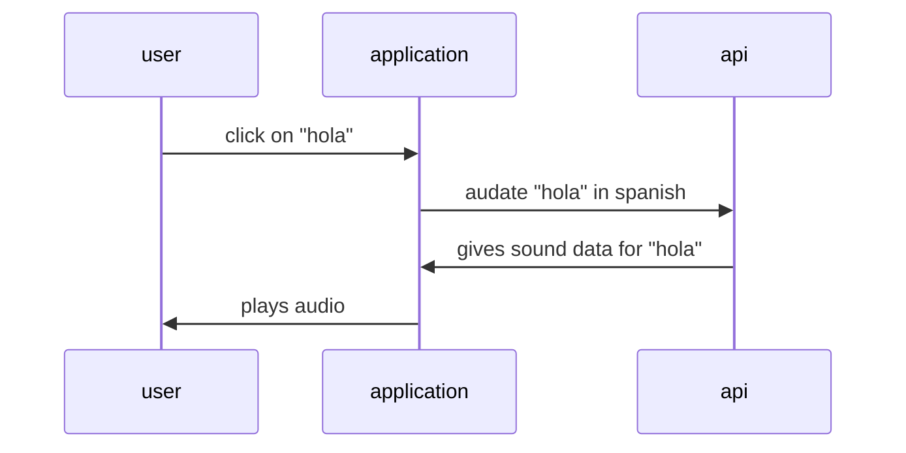

### Feature - Audio on word hover & click
- Medium Feature (3pts) - Definition is shown on word hover
- Small Feature (2pts) - Audio plays on word click

#### Description
**Definition On Word Hover**
- **Description**: When a word is hovered over, the definition will appear in a hover. The definition is fetched from the backend.

**Audio Plays On Word Click**
- **Description**: When a word is clicked, its pronunciation is depicted through audio using MDN's WebSpeech API. 

#### Diagram
Definition on word hover

### Feature - Design Language and Color Scheme
- Small Feature (2pts) - Color Scheme
- Medium Feature (3pts) - Design language

#### Description
**Color Scheme**
- **Description**: This feature standardizes the use of color across all pages.

**Design Language**
- **Description**: This feature integrates the design language of each page together, including sub-features such as typeface choice and layout.