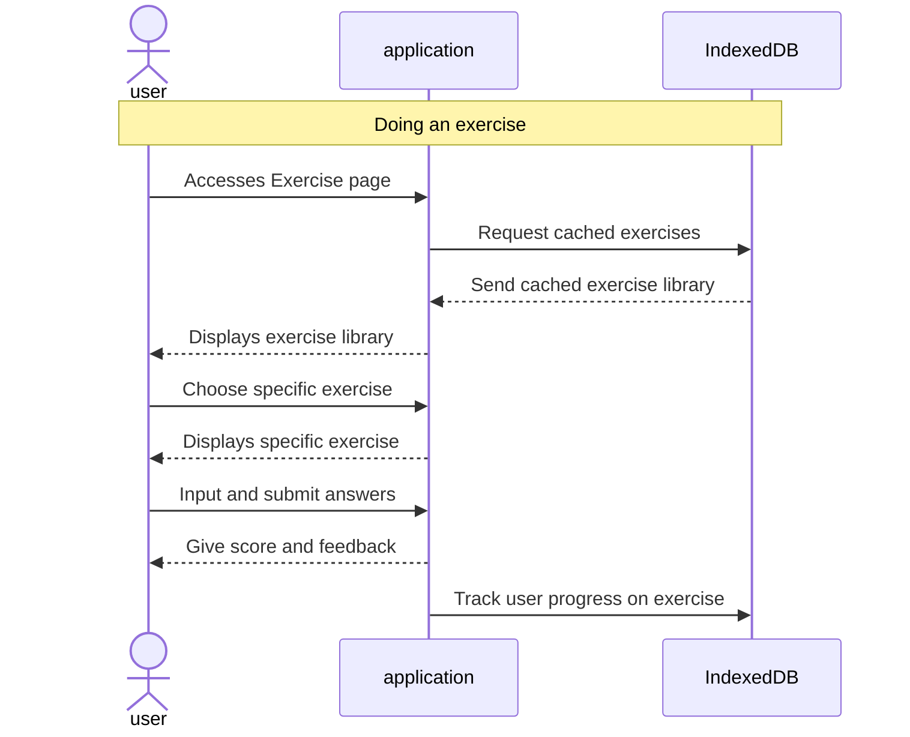

# Feature: exercise page

- design exercise structure (4 points)
- make user interface (3 points)
- implement scoring and feedback (2 point)
- track user progress (1 point)

## Feature descriptions

### Design exercise structure

To provide a diverse and engaging learning experience, the app will support multiple exercise types, including:
- Multiple Choice: Users select the correct answer from a list of options.
- Fill in the Blank: Users type the missing word or phrase in a sentence or paragraph.
- Matching: Users connect pairs of related items (e.g., words and their translations).
- Listening Comprehension: Users listen to audio clips and answer questions based on the content.
Each exercise will be defined by a JSON-like structure with attributes such as exercise type, prompt, correct answers, incorrect answers, hints, and feedback.

### Make user interface 

For an engage user experience, the interface should have an intuitive layout and clearly display the different exercise types. The input fields of each exercise should match each exercise type. Styling like typography and overall design language should match the rest of the web application.

### Implement scoring and feedback

Feedback should be displayed when an exercise is answered correctly or incorrectly.

### Track user progress 

When an exercise is answered, it should be scored and this attempt will be stored per user to track exercise progress over time.

