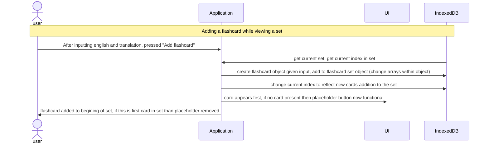

# Feature: Flashcards Page (10 points)

- Creating Sets and Integrating them (3 points)
- Creating Flashcards and Integrating them (3 points)
- Running Through Flashcards and Shuffling (3 points)
- Menus for Set View and Creation (1 point)

## Feature Descriptions

### Creating Sets and Integrating:

An add set box is always there to create new flashcards sets to use. New sets are automatically added to the page and put before this add set, and evenly spaced in the div. The creation of a set is simply inputting a name, but behind the scenes a flashcardset object is created and stored for it.

### Creating Flashcards and Integrating:

Within each set, you can create a flashcard and add the english and translation to it. These are integrated into the flashcard set object whose array of flashcard objects is changed to reflect the new object created. Additonally, an update function is called to change the current flashcard.

### Running Through Flashcards and Shuffling:

Flashcards are stored in the set object and so shuffling and chaning position are simply indexing through the flashcard array. The current position is stored as a global variable, and dhuffling involves copying the array and using another set attribute to index through.

### Menus for Set View and Creation:

Mostly CSS done to make overlays for viewing sets and making flashcards. Colors for buttons and hovering affects to make the menu cleaner. 

## Sequence Diagram for Creating Flashcards

