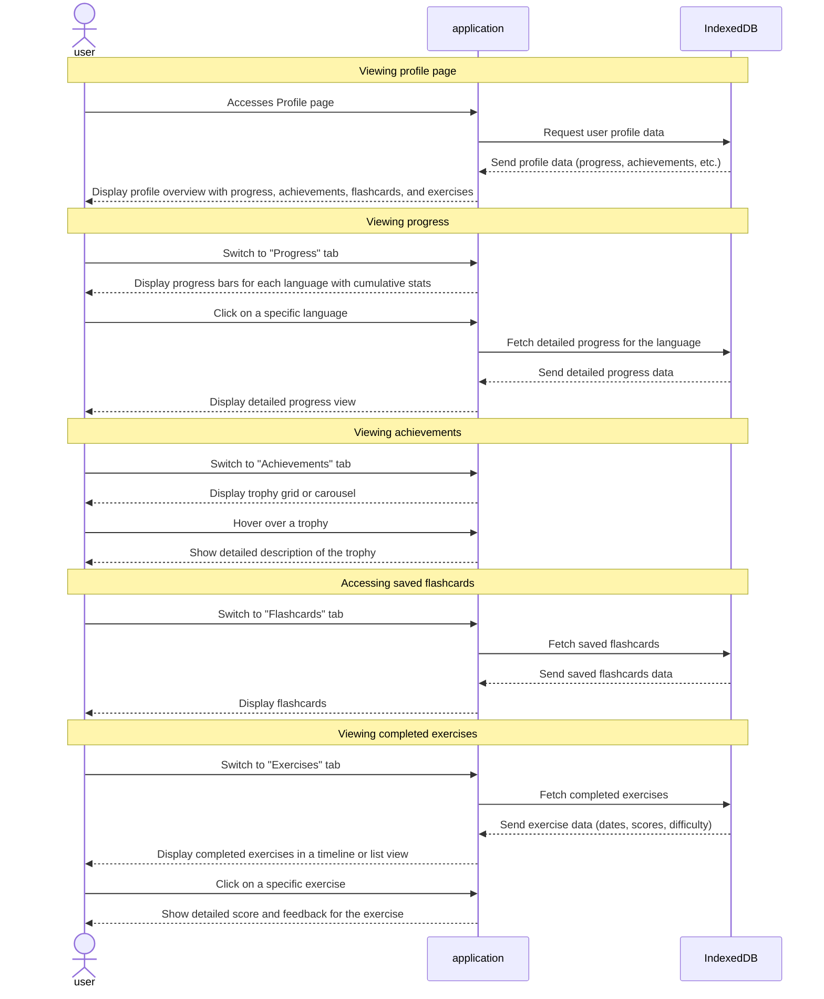

# Features: profile page

1. User Progress Overview (1 pts)

2. Trophies/Achievements (3pts)

3. Saved Flashcards (3pts)

4. Completed Exercises (3pts)

5. Account Information (1pt)

6. Additional Design Idea (1pt)

### Feature Descriptions

1. ## User Progress Overview (1 pts) ##

Description: Display progress bars or numerical indicators for each language the user is learning. Include metrics like proficiency percentage, total time spent, or levels completed.

Design Idea: Use horizontal progress bars with color coding for different languages. Add a summary section at the top showing cumulative learning stats (e.g., total hours studied, overall progress).

2. ## Trophies/Achievements (3pts) ## 

Description: Showcase awards or achievements earned by users, like streaks, level completions, or special challenges.

Design Idea: Create a grid or carousel of icons with brief descriptions. Include eye-catching graphics (medals, badges) with hover effects that show more details.

3. ## Saved Flashcards (3pts) ## 

Description: A section displaying flashcards that the user has saved for quick access and revision.

Design Idea: Use a compact card layout with options to flip for answers or details. Categorize them by language or type, with an option to filter.

4. ## Completed Exercises (3pts) ## 

Description: List or chart showing exercises the user has finished, including dates and scores.

Design Idea: Present a timeline view or a list with checkmarks for completed tasks. Add icons or small charts to indicate the difficulty level and score.

5. ## Account Information (1pt) ## 

Description: General user data such as profile picture, username, bio, joined date, and learning streaks.

Design Idea: Place this section near the top as a header with a user avatar, followed by user details in a clean, card-like layout.

6. ## Additional Design Ideas (1pt) ##

Navigation Tabs: Implement tabs or buttons to switch between "Progress," "Achievements," "Flashcards," and "Exercises" for easy navigation.

