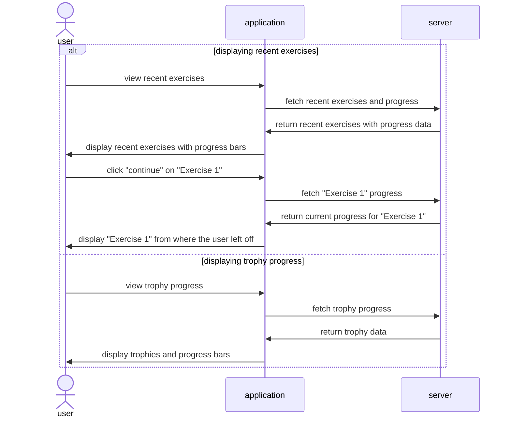

# Feature: Dashboard
- show recent exercises with a progress bar and continue/restart button (3 pts)
- show recently used flashcards (3 pts)
- showcasing trophy progress (3 pts)

## Feature Descriptions

### Show recent exercises with a progress bar and continue/restart button
Once a user logs in, it will display a few recent exercises that the user worked on the previous times that they visited the application. Under the name of each exercise, there will be a progress bar, colored in to visualize how much of the exercise the user has completed. The user can choose to continue an exercise directly from the dashboard. This takes them to the lesson and allows them to complete the exercise from where they left off. 

### Show recently used flashcards
Next to the recent exercises, there will also be recent flashcard decks. This allows the user quick access to the flashcards for an convenient, quick review. 

### Showcasing trophy progress
This will show the trophies that the user is working on and display the progress they have achieved so far with earning those trophies. Users collect more as they spend more time learning without our application. 

## Mermaid Diagram for Dashboard Features

